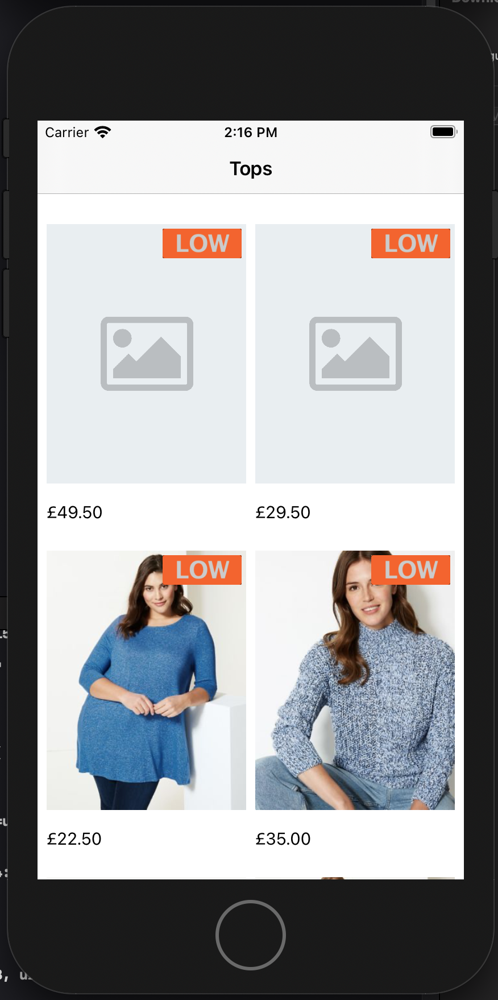
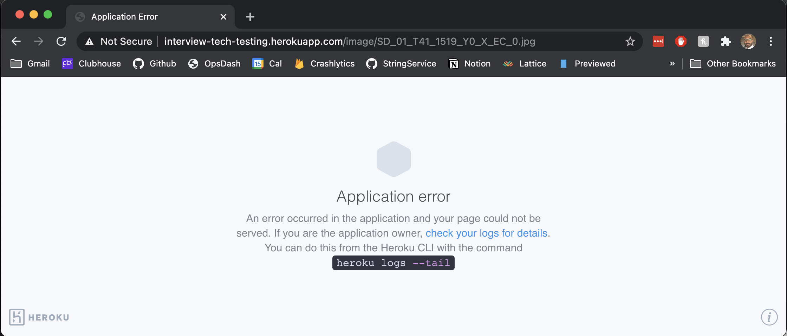

# ios-test

### Changing user id

To try different user ids the `var id` in `User.swift` can be modified.

### My approach

I've never done a test before which had such a complete starter project. It makes a lot of sense because I can show how I would add a feature to an existing codebase. Which is similar to the tasks I would be doing in the role.

Initially when I was reading the instructions, and hadn't yet opened the project, I was planning to use SwiftUI, Combine etc. But, of course, the project supports a minimum iOS12 (which also meant no `UICompositionalLayout`) so I used the frameworks available to iOS12.

The starter project's existing binding framework `(Observable)` is nice and elegant. It was easy to use, understand and implement.

To me it doesn't make sense to have multiple binding frameworks, or even different syntactic styles, in one codebase. It makes reading the code confusing if the same thing is done in 3 different ways all over the place. So I decided to make my code look like the starter as much as possible, on the assumption that the iOS team had agreed this was the style to follow and it didn't require any refactoring.

I took the approach that this was a feature given to me to work on, rather than a tech test, and, in doing that, I tidied up some of the existing code. E.g.
* Fixed a deprecated method `Date(bytes: value)` is deprecated in favour of `Data(value)`
* Removed the `productImage` property from the `ProductDetailsViewController` as it was always `nil` and didn't seem to be used
* I ran Swiftlint to ensure the formatting and syntax was all consistent. I find a linter works best when the entire iOS team agree on what they want their format and syntax to look like, and then customise a linter to enforce what the team agreed.

### Caching

I decided to add a simple Cache to the image service which resets every App session.
It is a static Dictionary which holds downloaded images as values, using their filenames as keys.
To make the cache thread-safe, I used a GCD concurrent Dispatch Queue with a `.barrier` flag which turns on mutual exclusivity.

### DispatchGroup

I used a `DispatchGroup` in the `ProductListingsViewModel` to avoid having a completion within a completion.
As there are only 2, relatively fast, network calls it's not strictly necessary. But good practice.

### App Coordinator

I created an App Coordinator which is responsible for navigating between view controllers.
I like this pattern as it takes one further responsibility away from VCs.
VCs no longer need to have any information about the other VCs in the app.

### Custom Coding

I wrote a custom Decoder for the availableBadges model to parse it from the raw String received from the backend into a nicer model object:

```
"loyalty:SLOTTED,BONUS||sale:PRIORITY_ACCESS,REDUCED"

to

struct Badge: Codable {
    let name: String
    let types: [String]
}

The logic is contained in UserOffers.swift
```

### Tests

I've included tests for the following:
* ProductListingsViewModel (For the ProductListingsViewController)
* BadgeIdentifer (logic which decides which badge should be shown)
* A UI Test which taps a cell and checks the ProductDetailsVC is navigated to

Given more time I would add tests for:
* ProductListingViewModel (For the ProductListingCell)
* AppCoordinator
• Image Cache
• Available Badges decoding

### Images not showing up

I noticed that occasionally the images wouldn't load and I was getting 503s from the server.
I manually tried to hit the url and saw the Heroku error screen below.
So if some images don't show up, it could be that again.



### Finally

I enjoyed the test, particularly exploring the starter project test setup and binding framework.

Thank you for giving me the opportunity!
